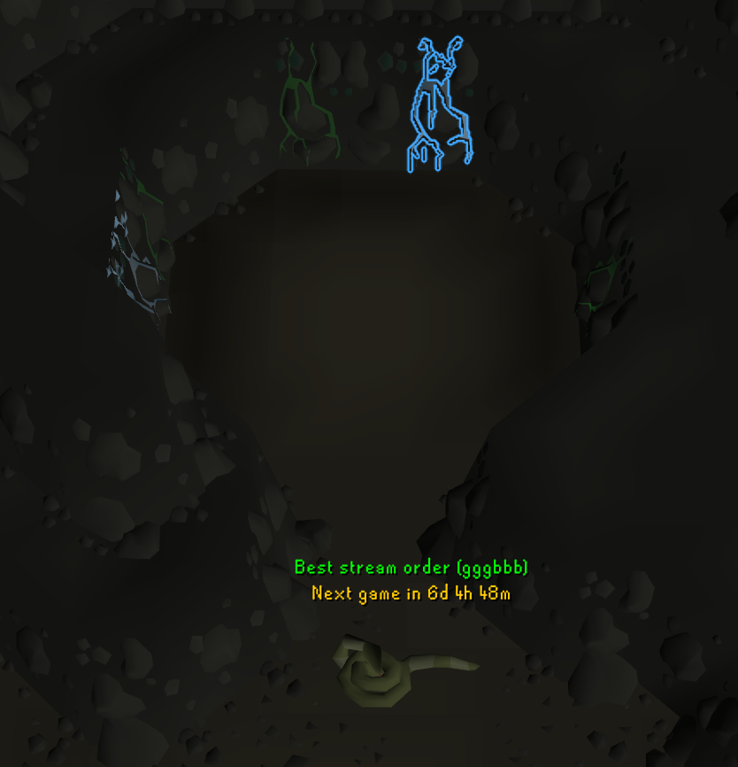

# Tears of Guthix Optimizer

Highlights the best weeping wall in Tears of Guthix, including when to wait at your wall for a blue
stream to land, using the stream mechanics described on the OSRS Wiki. Above Juna, it also shows
whether the world has the best stream order, when to enter, and when you can play next.

## Features

- **Best wall.** Outlines the stream to collect from, worked out from where every stream is and when
  each one moves next.
- **Wait.** When staying put is better, your wall is outlined in yellow with a countdown of the ticks
  left before it's time to move.
- **Preview.** Outside the wall room, the walls show the plugin's advice on the live streams, so you can
  see how it works before playing.
- **Stream order.** Shows above Juna whether the world moves its streams in the best order: green,
  green, green, blue, blue, blue.
- **When to enter.** Tell Juna a story and stop on her last line. A countdown shows when to continue
  so your game starts at a good point in the stream cycle.
- **Next game.** Shows above Juna how long until you can play again, and optionally the quest point or
  experience still needed.
- **World suggestions** (off by default). Suggests nearby worlds with the best stream order, with a
  hotkey (Ctrl+Shift+Up) to hop to the first one.
- **Expected tears** (off by default). Shows how many tears the highlighted wall is expected to give
  over the next 40 ticks.

## How it works

The OSRS Wiki describes the minigame: nine walls, three blue and three green streams, each staying for
16 ticks before moving to a random empty wall, one after another in an order fixed for each world.
The plugin tracks every stream, plays out possible futures from the current moment, and highlights
the choice that collects the most tears on average. Walking and start-up times were measured in game.

It works alongside RuneLite's built-in Tears of Guthix plugin, so its stream timers can stay on.

## Online world list

**Look up worlds online** is off by default. When turned on, it reads the stream orders that ToG
Crowdsourcing users have reported, from `togcrowdsourcing.com`, a third-party site that will see your
IP address. Nothing is ever sent to it, and no account information is shared. The list is only read
while you're at Juna.

To suggest nearby worlds, the plugin also times a connection to each candidate world's game server,
once per login. Only Jagex's servers are contacted for this.

## Reporting a problem

Turn on **Debug logging**, reproduce the problem, and include the lines containing `togoptimizer` from
your client log (`%USERPROFILE%\.runelite\logs\client.log` on Windows, `~/.runelite/logs/client.log`
on macOS and Linux). A short screen recording helps too.

## License

BSD 2-Clause. See [LICENSE](LICENSE).
